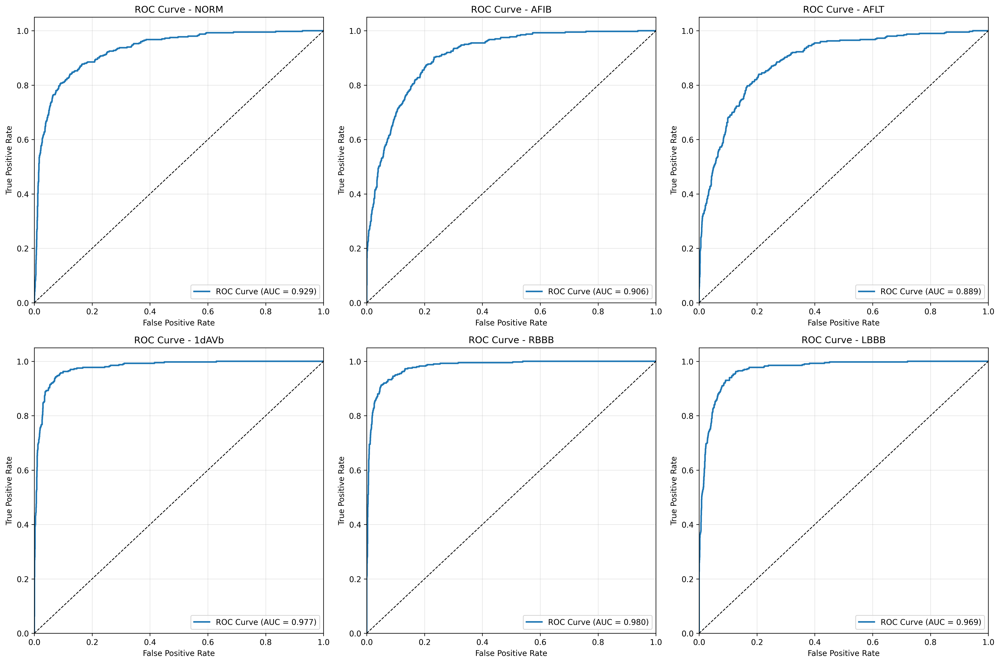
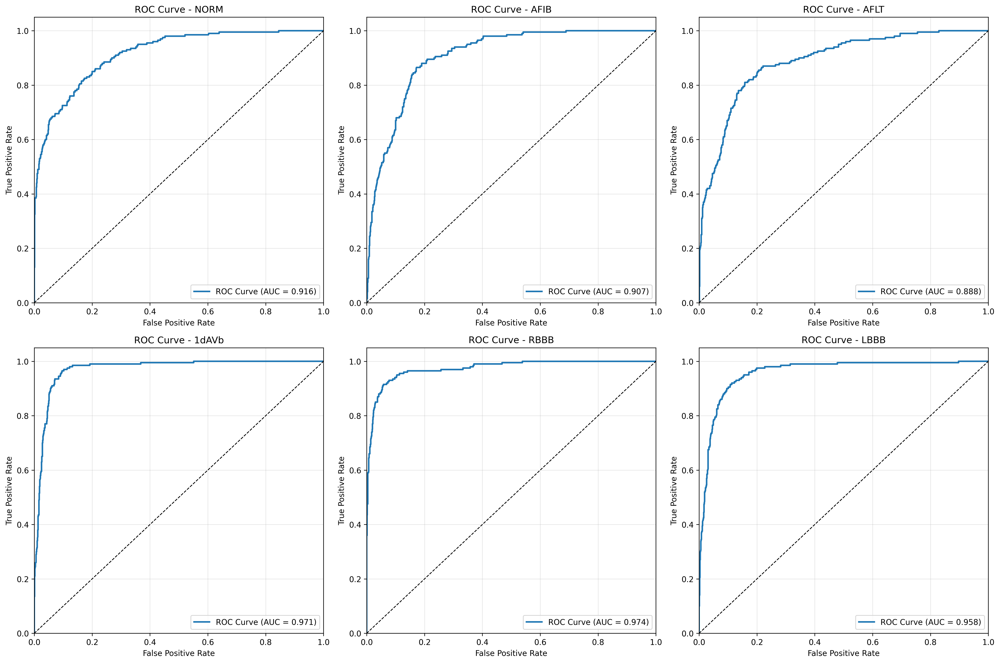
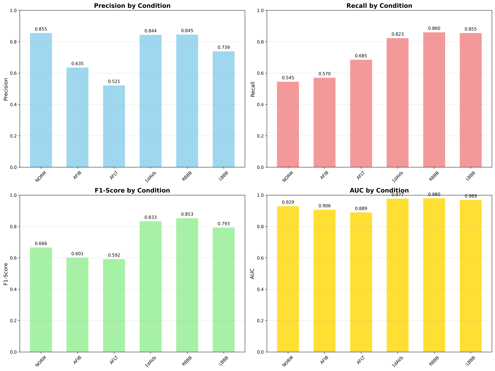
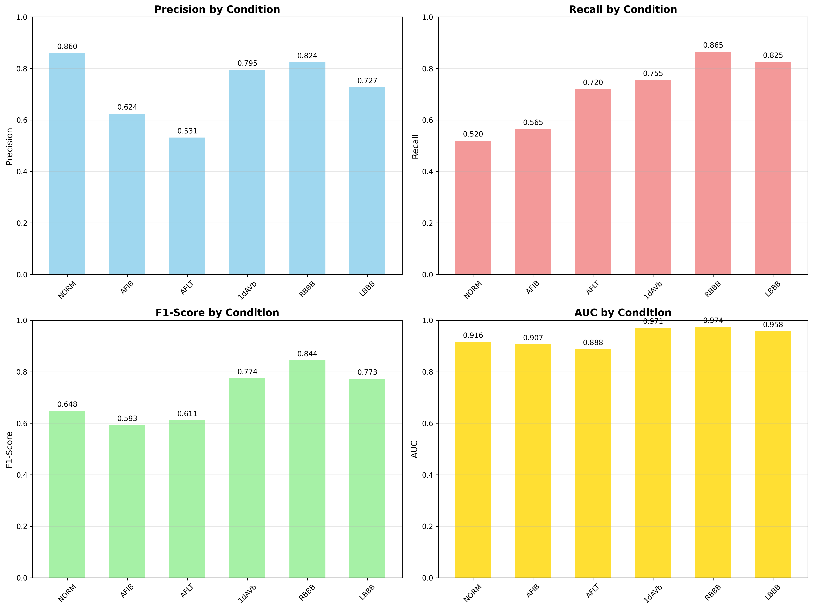
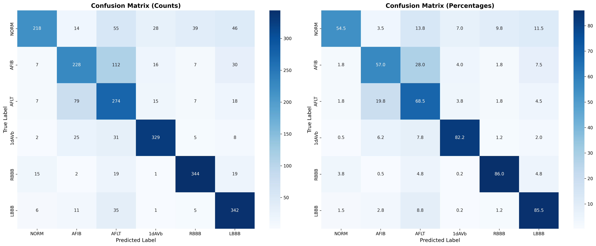
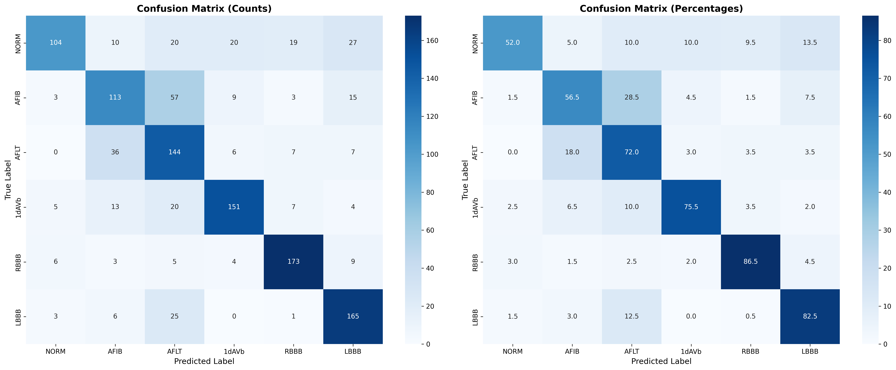

# 12-Lead ECG Classification Benchmark Results

## Overview
This directory (`ECGFounder/benchmark_results/benchmark_12lead_20250531_154045`) contains the benchmark results for a 12-lead ECG classification model evaluated on May 31, 2025. The model was tested on 6 cardiac conditions with 400 samples per class for validation and 200 samples per class for testing.

## Performance Metrics

### Validation Set Performance

| Condition | Precision | Recall | F1-Score | AUC | Support |
|-----------|-----------|--------|----------|-----|---------|
| NORM      | 0.855     | 0.545  | 0.666    | 0.929| 400     |
| AFIB      | 0.635     | 0.570  | 0.601    | 0.906| 400     |
| AFLT      | 0.521     | 0.685  | 0.592    | 0.889| 400     |
| 1dAVb     | 0.844     | 0.823  | 0.833    | 0.977| 400     |
| RBBB      | 0.845     | 0.860  | 0.853    | 0.980| 400     |
| LBBB      | 0.739     | 0.855  | 0.793    | 0.969| 400     |
| **Macro Avg** | **0.740** | **0.723** | **0.723** | **0.942** | **2400** |
| **Weighted Avg** | **0.740** | **0.723** | **0.723** | **-** | **2400** |

### Test Set Performance

| Condition | Precision | Recall | F1-Score | AUC | Support |
|-----------|-----------|--------|----------|-----|---------|
| NORM      | 0.860     | 0.520  | 0.648    | 0.916| 200     |
| AFIB      | 0.624     | 0.565  | 0.593    | 0.907| 200     |
| AFLT      | 0.531     | 0.720  | 0.611    | 0.888| 200     |
| 1dAVb     | 0.795     | 0.755  | 0.774    | 0.971| 200     |
| RBBB      | 0.824     | 0.865  | 0.844    | 0.974| 200     |
| LBBB      | 0.727     | 0.825  | 0.773    | 0.958| 200     |
| **Macro Avg** | **0.727** | **0.708** | **0.707** | **0.936** | **1200** |
| **Weighted Avg** | **0.727** | **0.708** | **0.707** | **-** | **1200** |

- **Validation Overall Accuracy**: 72.29%
- **Test Overall Accuracy**: 70.83%
- **Best performing class**: RBBB (Validation F1: 0.853, Test F1: 0.844)
- **Most challenging class**: AFIB (Validation F1: 0.601, Test F1: 0.593)

## Visualizations

### ROC Curves
#### Validation Set

#### Test Set

The ROC curves demonstrate the trade-off between sensitivity and specificity for each class. All classes show good discrimination ability with AUC values ranging from 0.889 to 0.980 on the validation set and 0.888 to 0.974 on the test set.

### Per-Class Metrics
#### Validation Set

#### Test Set

These visualizations compare precision, recall, and F1-score across all classes for both validation and test sets.

### Confusion Matrix
#### Validation Set

#### Test Set

The confusion matrices show the distribution of predictions for each true class. Notable observations:
- RBBB has the highest correct classification rate (344/400 validation, 173/200 test)
- AFIB has the lowest correct classification rate (228/400 validation, 113/200 test)
- Some confusion exists between AFIB and AFLT classes
- The model shows consistent performance patterns across both validation and test sets

## Abbreviations
- NORM: Normal ECG
- AFIB: Atrial Fibrillation
- AFLT: Atrial Flutter
- 1dAVb: First-degree Atrioventricular Block
- RBBB: Right Bundle Branch Block
- LBBB: Left Bundle Branch Block

## Files
- `detailed_results.json`: Complete benchmark metrics and raw data
- `performance_table.csv`: Summary performance metrics
- `roc_curves.png`: ROC curves for all classes
- `per_class_metrics.png`: Visual comparison of precision, recall, and F1-score
- `confusion_matrix.png`: Visualization of prediction errors 

## Location
This benchmark is located at `ECGFounder/benchmark_results/benchmark_12lead_20250531_154045/` within the NeuroKit project. To access these results, navigate to this directory from the project root.

## Running Similar Benchmarks
To run similar benchmarks, refer to the main ECGFounder documentation. The naming convention for benchmark folders follows the pattern: